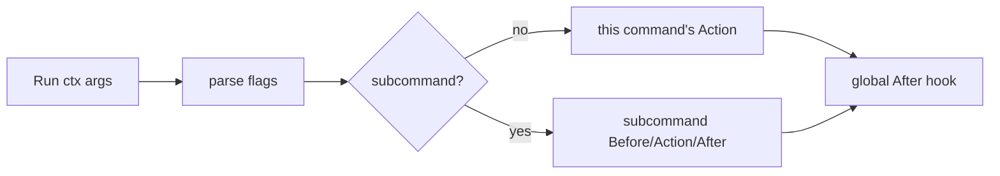

# cli

An embeddable Go command-line component library: command trees, hooks, interactive input, and rich terminal rendering out of the box.

[](https://github.com/chihqiang)
[](https://pkg.go.dev/github.com/chihqiang/cli)
[](go.mod)
[](LICENSE)
[](https://github.com/chihqiang/cli)
[](https://github.com/chihqiang/cli)

## Features

- **Command tree**: the root command (App) and subcommands are the same type, with nested subcommands, aliases, and hidden commands
- **Out of the box**: automatically registers `--help/-h`, `--verbose`, `--quiet`, `--no-interaction`; setting `Version` automatically enables `--version/-v`
- **Hooks**: global/command-level `Before` / `After` hooks, plus `CommandNotFound` for custom unmatched-command handling
- **Rich flag types**: string, integer, float, bool, duration, slices (repeatable/comma-separated), and generic custom types
- **Value source fallback**: command line > environment variable > default value (`Sources: cli.EnvVars("APP_LANG")`)
- **Leveled logging**: `Info` / `Success` / `Warn` / `Error` / `Debug` / `Verbose`, controlled by `--verbose` / `--quiet`
- **Rich table rendering**: 6 styles (ASCII / Markdown / borderless / Unicode box, etc.), with sections, separators, and East Asian wide-character alignment
- **Interactive Q&A**: free input, hidden input (password), confirmation, choice/multi-select, with validation, retries, and autocompletion
- **Tag-based colors**: `<info>...</info>` or attribute styles like `<fg=red;bg=blue>`, stripped automatically on non-terminals
- **Easy to test**: injectable `Stdin`; non-terminal environments degrade to defaults automatically, handy for pipes and unit tests

## Installation

```sh
go get github.com/chihqiang/cli
```

## Quick start

```go
package main

import (
	"context"
	"fmt"
	"os"

	"github.com/chihqiang/cli"
)

func main() {
	app := &cli.App{
		Name:    "hello",
		Usage:   "say hello to someone",
		Version: "1.0.0",
		Subcommands: []*cli.Command{
			{
				Name:    "greet",
				Aliases: []string{"g"},
				Usage:   "greet someone",
				Flags: []cli.Flag{
					&cli.BoolFlag{Name: "shout", Aliases: []string{"s"}, Usage: "shout the greeting"},
				},
				Action: func(ctx context.Context, in *cli.Input, out *cli.Output) error {
					name := "World"
					if in.Args().Present() {
						name = in.Args().First()
					}
					if in.Bool("shout") {
						out.Infof("HELLO, %s!", name)
					} else {
						out.Infof("Hello, %s!", name)
					}
					return nil
				},
			},
		},
	}

	if err := app.Run(context.Background(), os.Args); err != nil {
		fmt.Fprintln(os.Stderr, err)
		os.Exit(1)
	}
}
```

Sample output:

```console
$ go run . greet            # Hello, World!
$ go run . greet Alice -s   # HELLO, ALICE!
$ go run . --help           # auto-generated help
```

## Core concepts

### App and Command

`App` is a type alias for the root command (`type App = Command`); both are the same type and can nest subcommands recursively:

| Field | Description |
| --- | --- |
| `Name` / `Aliases` | Command name and aliases |
| `Usage` / `UsageText` / `Description` | Help text; `UsageText` customizes the usage line |
| `ArgsUsage` | Usage description for positional arguments |
| `Hidden` | Hidden in help, but still directly invocable |
| `Version` | Root command version; enables `--version/-v` |
| `Flags` / `Subcommands` | Flag list and subcommands |
| `Before` / `After` | Hooks before/after execution (defined on a subcommand they run with it; defined on the root they run once per invocation) |
| `Action` | Command execution function `func(ctx, *Input, *Output) error` |
| `CommandNotFound` | Handler for when a subcommand is not matched |
| `VersionPrinter` | Custom version printing function |
| `Stdin` | Injectable standard input (default `os.Stdin`) |

### Execution flow



### Input and Output

- **`Input`**: the input side. `in.Args()` positional arguments, typed getters like `in.String("name")` / `in.Bool("force")` / `in.Int("count")`, `in.IsSet("force")` to check whether a flag was explicitly set, `in.IsInteractive()` to check whether interaction is allowed, and `in.FindCommand("build")` to recursively find a subcommand by name/alias (for calling command B from inside command A)
- **`Output`**: the output side. Logging, table rendering, and interactive Q&A (details below)

## Flags

### Types

| Flag | Go type | Notes |
| --- | --- | --- |
| `StringFlag` | `string` | |
| `IntFlag` / `Int64Flag` / `UintFlag` | integers | |
| `Float64Flag` | `float64` | |
| `BoolFlag` | `bool` | does not consume the next token; only accepts `--flag` / `--flag=true` |
| `DurationFlag` | `time.Duration` | |
| `StringSliceFlag` / `IntSliceFlag` / `Float64SliceFlag` | slices | repeatable or comma-separated |
| `GenericFlag` | `flag.Value` | custom implementation, requires a non-nil `Value` |

All flags support: `Aliases` (single-char alias `-n`), `Required` (required validation), `Hidden`, `DefaultText`, and `Sources` (value source).

### Value priority

```text
command line > environment variable (Sources) > default value (Value)
```

```go
&cli.StringFlag{
	Name:    "lang",
	Usage:   "language",
	Value:   "en",
	Sources: cli.EnvVars("APP_LANG", "LANG"),
}
```

### Parsing rules

- `--name value` / `--name=value` / `-n value` / `-n=value` are all supported
- Positional arguments and flags can be interleaved (commands with subcommands stop parsing flags after the first positional argument, for subcommand dispatch)
- Everything after `--` is treated as positional arguments

## Logging

| Method | Level | Description |
| --- | --- | --- |
| `Info` / `Infof` | normal | suppressed by `--quiet` |
| `Success` / `Successf` | normal | suppressed by `--quiet` |
| `Warn` / `Warnf` | warning | written to stderr, not suppressed by `--quiet` |
| `Error` / `Errorf` | error | written to stderr, not suppressed by `--quiet` |
| `Debug` / `Debugf` | debug | requires `--verbose` |
| `Verbose` / `Verbosef` | verbose | requires `--verbose` |

```console
$ app --verbose ...   # prints Debug/Verbose
$ app --quiet ...     # only Warn/Error
```

## Tables

```go
// Simple table
out.Table([]string{"Name", "Score"}, [][]string{{"Alice", "90"}, {"Bob", "85"}})

// Custom table: styles, sections, separators, heterogeneous cells
t := cli.NewTable()
t.SetStyle("box") // default | compact | markdown | borderless | box | box-double
t.SetHeader([]string{"Item", "Qty", "Price"}, cli.AlignLeft)
t.AddSection("Fruits")
t.AddRowAny([]interface{}{"Apple", 3, 1.5}, false)
t.AddSeparator()
t.AddRowAny([]interface{}{"Coffee", 1, 2.0}, false)
out.RenderTable(t)
```

Alignment `AlignLeft` / `AlignRight` / `AlignCenter` is supported; column widths are computed automatically, correctly handling East Asian wide characters such as CJK.

## Interactive Q&A

| Method | Description |
| --- | --- |
| `AskString(question, default)` | string input |
| `Ask(question, default)` | generic input, returns any default type |
| `AskHidden(question)` | hidden input (password, no echo) |
| `Confirm(question, default)` | yes/no confirmation |
| `Choice(question, choices, default)` | single / multi select (`SetMultiselect(true)`) |

In non-interactive environments (pipe / `--no-interaction`) the Q&A automatically returns the default value; explicitly injecting `app.Stdin` forces interaction, handy for automated tests:

```console
$ printf 'Zhang\n25\nsecret\ny\npy\n' | go run ./example/ask survey
```

Advanced capabilities: `SetValidator` validation, `SetMaxAttempts` retry count, `SetNormalizer` normalization, `SetAutocompleterValues` autocompletion candidates.

## Colors

`Output` uses tag-based rendering; the underlying color generation is delegated to `fatih/color` (color codes are stripped on non-terminals):

```go
out.Infof("user <info>%s</info> logged in <success>successfully</success>", name)
out.Errorf("error <fg=red;bg=white;op=bold>%v</fg=red;bg=white;op=bold>", err)
```

Builtin styles: `error` / `info` / `comment` / `warning` / `success` / `question` / `highlight`. Custom styles can be added with `Formatter.SetStyle("name", "32")`.

## Error handling

```go
// Exit early with an exit code
if in.String("token") == "" {
	return cli.Exit(1, "missing token")
}

// Typed errors
var ue *cli.UsageError    // usage error (unknown option, missing required flag, etc.)
var nf *cli.NotFoundError // help topic/command does not exist
```

## Builtin commands and flags

| Builtin | Description |
| --- | --- |
| `--help` / `-h` | show help (root command or subcommand) |
| `--version` / `-v` | print the version (only after `Version` is set) |
| `help [command]` | builtin help subcommand |
| `version` | builtin version subcommand |
| `--verbose` | debug-level output |
| `--quiet` | suppress normal output |
| `--no-interaction` | disable interactive Q&A |

## Examples

The `example/` directory contains complete runnable examples:

| Directory | Demonstrates |
| --- | --- |
| `hello` | minimal intro: command, argument, flag |
| `commands` | command organization & help: grouping, hidden commands, `CommandNotFound` |
| `flags` | every flag type and value sources |
| `ask` | interactive Q&A (including feeding answers via a pipe) |
| `table` | multi-style table rendering |
| `logging` | leveled logging and level control |
| `invoke` | three ways to call command B from inside command A |

```sh
go run ./example/hello greet Alice --shout
go run ./example/commands --help
go run ./example/flags --token abc --tags a --tags b
go run ./example/table box
go run ./example/ask survey
go run ./example/logging --verbose demo
go run ./example/invoke deploy --env prod
```

## Testing

```sh
go test ./...   # all unit tests
```

## License

[Apache-2.0](LICENSE)
